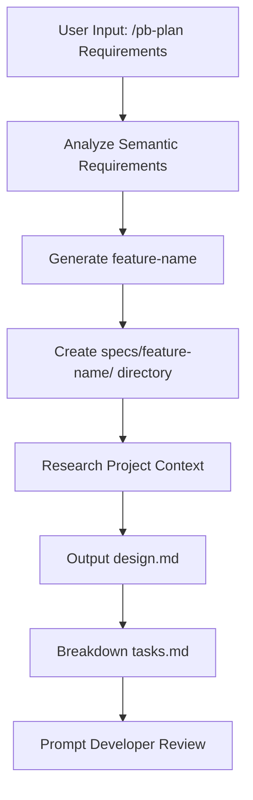
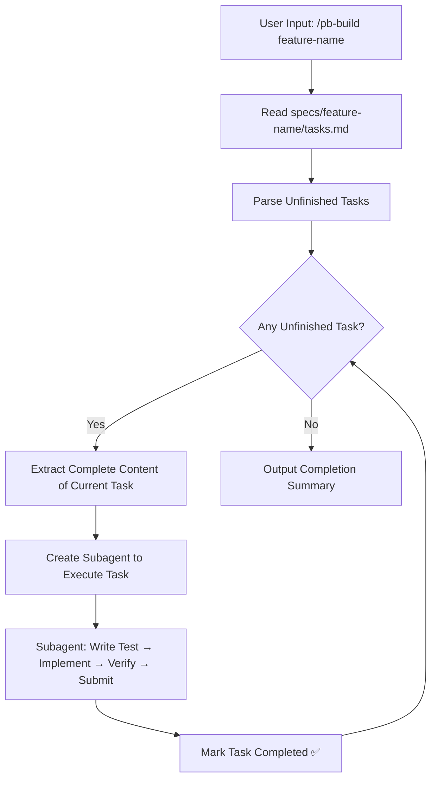

# Design Document: pb-spec (Plan-Build Spec)

| Metadata | Details |
| :--- | :--- |
| **Author** | akagi201 |
| **Status** | Draft |
| **Created** | 2025-02-11 |
| **Related** | [ui-ux-pro-max-skill](https://github.com/nextlevelbuilder/ui-ux-pro-max-skill), [lightspec-loop](https://github.com/viteinfinite/skills/tree/main/skills/lightspec-loop) |

## 1. Executive Summary

**Problem:** Current AI coding assistants (Claude Code, VS Code Copilot, OpenCode) face several pain points when handling complex requirements:

1. Frequent conversational round-trips to confirm designs, leading to low efficiency and context loss.
2. Lack of a structured "Design → Task Breakdown → Task Implementation" workflow.
3. Scattered skill/prompt configurations across different AI tools, lacking unified management.

**Solution:** `pb-spec` (Plan-Build Spec) is a Python uv-based CLI tool + AI Skill system that offers:

- A unified CLI to install/manage skill files into the configuration directories of specific AI tools.
- Three core agent prompts: `/pb-init` (Project Initialization), `/pb-plan` (Design + Task Breakdown), and `/pb-build` (Subagent-Driven Implementation).
- Utilization of a build/agent mode only, outputting specific full solution documentation for developer review in one go, avoiding tentative multi-turn conversations.

---

## 2. Requirements & Goals

### 2.1 Problem Statement

The skill ecosystem for existing AI programming tools is fragmented. Claude Code uses `.claude/skills/`, VS Code Copilot uses `.github/prompts/`, and OpenCode uses `.opencode/skills/`. Developers need to manually maintain prompt files for each tool, and there is a lack of a standardized Plan-Build workflow to manage complex feature development.

### 2.2 Functional Goals

1. **CLI Tool `pb-spec`**: Developed based on Python uv, supporting `init`, `version`, and `update` subcommands.
2. **Skill File Generation**: `pb-spec init --ai <claude/copilot/opencode/all>` installs pb-spec skills into the corresponding AI tool's configuration directory.
3. **Three Core Agent Prompts**:
   - `/pb-init`: Analyzes project structure and generates/updates the `AGENTS.md` project status file.
   - `/pb-plan`: Receives requirement descriptions and outputs a complete design proposal (`specs/<YYYY-MM-DD-NO-feature-name>/design.md`) + task list (`specs/<YYYY-MM-DD-NO-feature-name>/tasks.md`).
   - `/pb-build`: Reads `tasks.md`, creates subagents for each task, and implements them via TDD.

### 2.3 Non-Functional Goals

- **Zero Dependencies**: CLI uses only Python standard library + `click` (or similar lightweight library).
- **Simplicity**: Total code size controlled within ~1000 lines.
- **Cross-Platform**: macOS / Linux / Windows support.
- **Extensible**: Easily add support for new AI tools (e.g., Cursor, Windsurf) in the future.

### 2.4 Out of Scope

- Support for other AI tools like Cursor, Windsurf (V1 only supports Claude/Copilot/OpenCode).
- Implementation of AI model calls or API interactions (pb is just a skill file generator + prompt templates).
- Design-system search engine implementation (unlike ui-ux-pro-max, pb focuses on the Plan-Build workflow).
- Plugin marketplace publishing.

---

## 3. Architecture Overview

### 3.1 System Architecture

```text
pb-spec/                           # This repo - Spec definition and source code
├── src/pb/                        # Python CLI source
│   ├── __init__.py
│   ├── cli.py                     # CLI entry point (click)
│   ├── commands/
│   │   ├── __init__.py
│   │   ├── init.py                # pb init command
│   │   ├── version.py             # pb version command
│   │   └── update.py              # pb update command
│   ├── platforms/                 # Platform configurations
│   │   ├── __init__.py
│   │   ├── base.py                # Platform base class
│   │   ├── claude.py              # Claude Code configuration
│   │   ├── copilot.py             # VS Code Copilot configuration
│   │   └── opencode.py            # OpenCode configuration
│   └── templates/                 # Resource templates (packaged into wheel)
│       ├── skills/
│       │   ├── pb-init/
│       │   │   └── SKILL.md
│       │   ├── pb-plan/
│       │   │   ├── SKILL.md
│       │   │   └── references/
│       │   │       ├── design_template.md
│       │   │       └── tasks_template.md
│       │   └── pb-build/
│       │       ├── SKILL.md
│       │       └── references/
│       │           └── implementer_prompt.md
│       └── prompts/               # Copilot workflow versions
│           ├── pb-init.prompt.md
│           ├── pb-plan.prompt.md
│           └── pb-build.prompt.md
├── pyproject.toml                 # uv/PEP 621 project configuration
├── docs/
│   ├── design.md                  # This document
│   ├── tasks.md                   # Implementation tasks
│   ├── design_template.md         # design.md template
│   ├── tasks_template.md          # tasks.md template
│   └── plan.agent.md              # plan agent reference
└── tests/
    ├── test_cli.py
    ├── test_init.py
    └── test_platforms.py
```

### 3.2 Platform Target Directory Mapping

| AI Tool | Skill Mode | Target Directory | File Format |
|---------|-----------|---------|---------|
| Claude Code | Skill | `.claude/skills/pb-<name>/SKILL.md` | YAML frontmatter + Markdown |
| VS Code Copilot | Prompt | `.github/prompts/pb-<name>.prompt.md` | Markdown (no frontmatter) |
| OpenCode | Skill | `.opencode/skills/pb-<name>/SKILL.md` | YAML frontmatter + Markdown |

### 3.3 Key Design Principles

1. **Template-Based Generation**: All skill files are generated from `src/pb/templates/`. Different platforms only differ in file path and format.
2. **Only Build Mode**: All agent prompts run in build/agent mode—directly outputting the complete solution without multi-turn questioning.
3. **Fresh Subagent per Task**: `/pb-build` adopts the lightspec-loop pattern, assigning an independent subagent to each task to avoid context pollution.
4. **Design-First**: Mandatory design before implementation. `/pb-plan` must output complete `design.md` + `tasks.md`, and developers only enter build phase after review.

---

## 4. Detailed Design

### 4.1 CLI (`pb-spec`)

#### Tech Stack

- Python 3.12+, managed by `uv`.
- CLI Framework: `click` (lightweight, mature).
- Version Management: `importlib.metadata` reads version from `pyproject.toml`.
- Packaging: `uv build` generates wheel, `uv tool install` supports global installation.

#### `pb-spec init --ai <target>`

```python
# Pseudo-code
def init(ai: str, force: bool = False):
    """Install pb-spec skill files into the current project"""
    cwd = Path.cwd()
    targets = resolve_targets(ai)  # claude/copilot/opencode/all

    for target in targets:
        platform = get_platform(target)  # Returns Platform instance
        installed = platform.install(cwd, force=force)
        print(f"  + {installed}")

        print("pb-spec skills installed successfully!")
```

**Platform Abstraction:**

```python
from abc import ABC, abstractmethod
from pathlib import Path

class Platform(ABC):
    """AI Platform Adapter Base Class"""

    @property
    @abstractmethod
    def name(self) -> str: ...

    @property
    @abstractmethod
    def skill_names(self) -> list[str]:
        """Return list of skill names to install"""
        return ["pb-init", "pb-plan", "pb-build"]

    @abstractmethod
    def get_skill_path(self, cwd: Path, skill_name: str) -> Path:
        """Return path for skill file in target project"""
        ...

    @abstractmethod
    def render_skill(self, skill_name: str, template_content: str) -> str:
        """Render template content into platform-specific format"""
        ...

    def install(self, cwd: Path, force: bool = False) -> list[str]:
        """Install all skills to target directory"""
        installed = []
        for skill_name in self.skill_names:
            target = self.get_skill_path(cwd, skill_name)
            if target.exists() and not force:
                print(f"  Skipping {target} (exists, use --force)")
                continue
            content = self._load_and_render(skill_name)
            target.parent.mkdir(parents=True, exist_ok=True)
            target.write_text(content)
            installed.append(str(target.relative_to(cwd)))
        return installed
```

**Platform Implementation Example (Claude):**

```python
class ClaudePlatform(Platform):
    name = "claude"

    def get_skill_path(self, cwd: Path, skill_name: str) -> Path:
        return cwd / ".claude" / "skills" / skill_name / "SKILL.md"

    def render_skill(self, skill_name: str, template_content: str) -> str:
        # Claude uses YAML frontmatter + markdown body
        meta = SKILL_METADATA[skill_name]
        frontmatter = f"---\nname: {skill_name}\ndescription: \"{meta['description']}\"\n---\n\n"
        return frontmatter + template_content
```

**Platform Implementation Example (Copilot):**

```python
class CopilotPlatform(Platform):
    name = "copilot"

    def get_skill_path(self, cwd: Path, skill_name: str) -> Path:
        return cwd / ".github" / "prompts" / f"{skill_name}.prompt.md"

    def render_skill(self, skill_name: str, template_content: str) -> str:
        # Copilot doesn't need frontmatter, output markdown directly
        return template_content
```

#### `pb-spec version`

```python
def version():
    """Display pb-spec version"""
    from importlib.metadata import version as get_version
    print(f"pb-spec {get_version('pb-spec')}")
```

#### `pb-spec update`

```python
def update():
    """Update pb-spec to the latest version"""
    import subprocess
    subprocess.run(["uv", "tool", "upgrade", "pb-spec"], check=True)
```

### 4.2 Skill: `/pb-init`

**Function:** Analyzes the current project structure, generates or updates `AGENTS.md` to provide project context for subsequent plan/build steps.

**AGENTS.md Content:**

```markdown
# AGENTS.md

> Auto-generated by pb-spec-init. Last updated: YYYY-MM-DD

## Project Overview

- **Language**: Python/Rust/TypeScript/...
- **Framework**: FastAPI/Actix/Next.js/...
- **Build Tool**: uv/cargo/npm/...
- **Test Command**: pytest/cargo test/vitest/...

## Project Structure

<auto-detected directory tree, depth=3>

## Key Files

- Entry point: src/main.py
- Config: pyproject.toml
- Tests: tests/

## Conventions

- Commit style: conventional commits
- Branch strategy: feature branches

## Active Specs

<list of specs/<YYYY-MM-DD-NO-feature-name> directories with status>
```

**Agent Behavior:**

1. Scans project root, detects language/framework/build tools.
2. Traverses directory tree (depth 3), generates structure overview.
3. Checks active feature specs under `specs/`.
4. Writes results to `AGENTS.md` (Idempotent: overwrite/update, not append).

### 4.3 Skill: `/pb-plan`

**Function:** Receives requirement description, outputs complete design proposal and task breakdown. This is the core of the pb workflow—directly outputting the optimal solution to avoid multi-turn conversations.

**Workflow:**



**feature-name Generation Rules:**

- Extract core keywords from requirement description.
- Max 4 words, connected with `-`.
- All lowercase, no special characters.
- Example: `add-websocket-auth`, `refactor-api-client`, `user-profile-page`.

**Agent Behavior:**

```markdown
## /pb-plan Agent Behavior Specification

1. **Requirement Analysis**: Parse user input, extract core requirements.
2. **Context Collection**:
   - Read AGENTS.md (if exists).
   - Search related code files and directories.
   - Understand project tech stack and conventions.
3. **Generate feature-name**: Generate concise directory name from requirement semantics.
4. **Output design.md**: Use design_template.md, fully filling all sections.
   - Executive Summary
   - Requirements & Goals (including Out of Scope)
   - Architecture Overview (including Mermaid diagrams)
   - Detailed Design (including Pseudo-code/Interface definitions)
   - Verification Strategy
5. **Output tasks.md**: Use tasks_template.md.
   - Break down implementation plan from design.md into concrete tasks.
   - Each task 2-6 hours.
   - Each task includes: Context, Steps, Verification.
   - Tasks arranged in dependency order (Phase grouping).
6. **No Confirmation**: Output complete plan directly. User can request changes after review.
```

**specs Directory Structure:**

```text
specs/
└── 2026-02-15-01-add-websocket-auth/
    ├── design.md          # Complete Design Document
    └── tasks.md           # Task List (with checkboxes)
```

### 4.4 Skill: `/pb-build`

**Function:** Reads `specs/<YYYY-MM-DD-NO-feature-name>/tasks.md` and implements task by task using Subagent-Driven Development mode.

**Core Principles:** Inspired by lightspec-loop + subagent-driven-development:

- **One Subagent Per Task**: Each task spawns an independent implementation subagent.
- **TDD Driven**: Each subagent writes tests before implementation.
- **Self-Review**: Subagent reviews itself after implementation.
- **Sequential Execution**: Execute one by one according to the order in tasks.md.
- **State Tracking**: Completed tasks are marked with checkboxes in tasks.md.

**Workflow:**



**Subagent Instruction Template:**

```markdown
You are implementing Task N: [task name]

## Task Description

[Full task content extracted from tasks.md]

## Project Context

[Project context extracted from AGENTS.md and design.md]

## Your Job

1. Read design.md to understand the overall design.
2. Follow TDD methodology:
   a. Write a failing test.
   b. Run test to confirm failure.
   c. Write minimal implementation to pass the test.
   d. Run test to confirm pass.
3. Self-Review:
   - Did I fully implement the task requirements?
   - Did I follow project conventions?
   - Is there any over-engineering?
4. Submit code.

## Constraints

- Only implement what is described in the current task, do not do more.
- Follow YAGNI principle.
- Use existing patterns and conventions of the project.
```

**Task State Tracking:**

Use Markdown checkboxes in tasks.md to track state:

- `- [ ]` → Unfinished
- `- [x]` → Completed

After `/pb-build` completes a task, it automatically updates the corresponding checkbox from `- [ ]` to `- [x]`.

### 4.5 Template System

All skill content is stored as Markdown templates in `src/pb/templates/`. The CLI's `init` command performs simple variable substitution and format adaptation based on the target platform.

**Template Variables:**

- No complex template engine, use Python `str.replace()` for simple substitution.
- Variables: `{{SKILL_NAME}}`, `{{DESCRIPTION}}`, etc. (Used only where necessary).

**Platform Format Differences:**

| Difference | Claude Code | VS Code Copilot | OpenCode |
|-------|------------|----------------|---------|
| Prefix | YAML frontmatter | None | YAML frontmatter |
| Filename | `SKILL.md` | `<name>.prompt.md` | `SKILL.md` |
| Directory | `.claude/skills/<name>/` | `.github/prompts/` | `.opencode/skills/<name>/` |
| Reference File | `references/` subdirectory | inline or `#file` reference | `references/` subdirectory |

**Special Handling for Copilot:**

- Copilot does not support skill directory structure; all content is packaged into a single `.prompt.md` file.
- Content in `references/` is inlined directly into the prompt file.
- Use `#file:` reference instead of directory path reference.

---

## 5. Verification & Testing Strategy

### 5.1 Unit Tests

| Test Target | Test Content |
|---------|---------|
| `Platform.get_skill_path()` | Correct path generation for each platform |
| `Platform.render_skill()` | Template rendering results match platform format |
| CLI Argument Parsing | Correct parsing of `--ai`, `--force`, etc. |

### 5.2 Integration Tests

| Test Scenario | Verification Method |
|---------|---------|
| `pb init --ai claude` | Check existence of `.claude/skills/pb-*` directories and files |
| `pb init --ai all` | Check correct generation of directories for all 3 platforms |
| `pb init --force` | Overwrite existing files |
| `pb init` (Repeated run) | Skip existing files |

### 5.3 Skill Content Verification

| Verification Item | Method |
|-------|------|
| YAML frontmatter Format | Parse and check existence of `name` and `description` fields |
| Markdown Syntax | Lint check (optional) |
| No Residual Template Variables | Check rendered files do not contain `{{` `}}` |
| Valid Reference Paths | Check if files in `references/` actually exist |

---

## 6. Skill Content Design

### 6.1 pb-init SKILL.md Core Content

```markdown
# pb-init: Project State Initialization

Analyzes current project structure, generates or updates AGENTS.md project status file.

## Behavior Specification

1. Scan project root, detect:
   - Programming Language (package.json → JS/TS, pyproject.toml → Python, Cargo.toml → Rust, go.mod → Go)
   - Framework (Infer from dependencies and directory structure)
   - Build/Test Commands
2. Generate Directory Tree (depth 3, ignore node_modules/.git etc.)
3. Check active specs under specs/ directory
4. Write AGENTS.md (Idempotent update)

## Output Format

[AGENTS.md Template]

## Constraints

- Do not modify any project source code
- Read-only analysis + write AGENTS.md
- Completely overwrite AGENTS.md on every run (no append)
```

### 6.2 pb-plan SKILL.md Core Content

```markdown
# pb-plan: Design & Task Planning

Receives requirement description, outputs complete design proposal and task breakdown.

## Behavior Specification

1. Parse requirements, generate feature-name (≤4 words, kebab-case)
2. Collect project context (AGENTS.md, related source code)
3. Create specs/<YYYY-MM-DD-NO-feature-name>/ directory (ensure feature-name uniqueness across existing specs)
4. Output design.md — use design_template.md to fill fully
5. Output tasks.md — use tasks_template.md to break down tasks
6. No confirmation required, output optimal solution directly

## Key Principles

- Output complete solution in one go, no multi-turn probing
- Each task granularity: 2-6 hours
- Each task must have Verification
- Tasks arranged in dependency order

## Template

Read references/design_template.md and references/tasks_template.md
```

### 6.3 pb-build SKILL.md Core Content

```markdown
# pb-build: Subagent-Driven Implementation

Reads tasks.md, assigns subagents task by task, TDD driven implementation.

## Behavior Specification

1. Read specs/<YYYY-MM-DD-NO-feature-name>/tasks.md
2. Parse all unfinished tasks (- [ ])
3. For each task:
   a. Extract complete task content
   b. Read design.md to get design context
   c. Create subagent, pass implementer_prompt template
   d. Subagent execution: Write Test → Implement → Verify → Self-Review → Submit
   e. Mark task completed (- [x])
4. Output summary

## Subagent Template

Read references/implementer_prompt.md

## Constraints

- Sequential execution, no parallel
- Each subagent does only one task
- TDD: Test before implementation
- YAGNI: No over-engineering
- Update tasks.md checkbox after completion
```

---

## 7. Cross-Functional Concerns

### 7.1 Versioning & Release

- Use `version` field in `pyproject.toml`.
- Publish to PyPI: `uv build && uv publish`.
- User installation: `uv tool install pb-spec` or `pipx install pb-spec`.

### 7.2 Backward Compatibility

- Template updates do not affect installed skill files.
- `pb-spec update` updates CLI itself, does not automatically overwrite installed skills.
- Users need to run `pb-spec init --force` to update installed skill files.

### 7.3 Error Handling

- Target directory does not exist: Create automatically.
- File exists and no `--force`: Skip and prompt.
- `uv` not installed (update command): Prompt user to install uv.

---

## 8. Differences from Reference Projects

### vs. ui-ux-pro-max-skill

| Aspect | ui-ux-pro-max | pb |
|-----|--------------|-----|
| Positioning | UI/UX Design Intelligence | Plan-Build Spec Development Workflow |
| CLI Language | TypeScript (npm) | Python (uv) |
| Platform Count | 15+ | 3 (claude/copilot/opencode) |
| Core Features | CSV Search Engine + Design System Gen | Design Generation + Subagent Implementation |
| Skill Content | Static reference data | Dynamic agent behavior specs |

### vs. lightspec-loop

| Aspect | lightspec-loop | pb-build |
|-----|--------------|---------|
| Spec Source | Managed by LightSpec CLI | specs/<YYYY-MM-DD-NO-feature-name>/tasks.md file |
| Execution Trigger | `lightspec view` discovery | Directly read tasks.md |
| Task Granularity | Each spec is a change proposal | Each task is an implementation step in design |
| Archiving Mechanism | `lightspec:archive` command | Markdown checkbox marking |

---

## 9. Appendix

### 9.1 pb-spec CLI Commands

```text
pb-spec init --ai <claude|copilot|opencode|all> [--force]   # Install skill files
pb-spec version                                              # Show version
pb-spec update                                               # Update to latest version
```

### 9.2 User Workflow Example

```bash
# 1. Install pb-spec
uv tool install pb-spec

# 2. Initialize skills in project
cd my-project
pb-spec init --ai claude

# 3. Use in Claude Code
# /pb-init                              → Generate AGENTS.md
# /pb-plan Add WebSocket Auth Support   → Generate specs/2026-02-15-01-add-websocket-auth/
# (review design.md and tasks.md)
# /pb-build add-websocket-auth           → Implement task by task
```

### 9.3 References

- [ui-ux-pro-max-skill](https://github.com/nextlevelbuilder/ui-ux-pro-max-skill) - CLI + Template Architecture Reference
- [lightspec-loop](https://github.com/viteinfinite/skills/tree/main/skills/lightspec-loop) - Subagent-Driven Development Reference
- [superpowers:subagent-driven-development](https://github.com/obra/superpowers) - Subagent Workflow Reference
- [Open Ralph Wiggum](https://github.com/Th0rgal/open-ralph-wiggum) - Product Thinking & Verification Standard Reference
