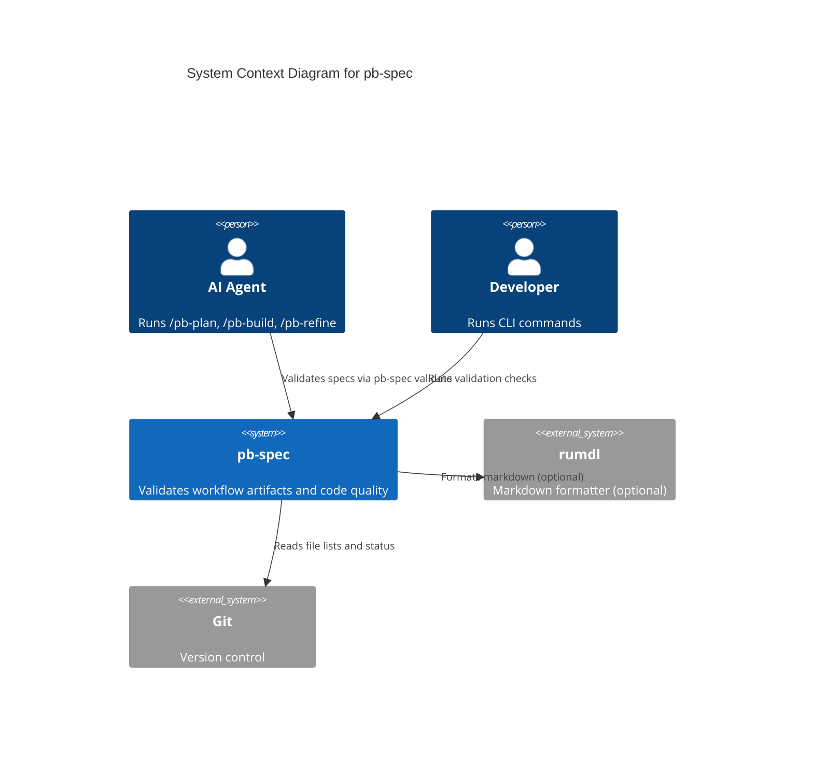
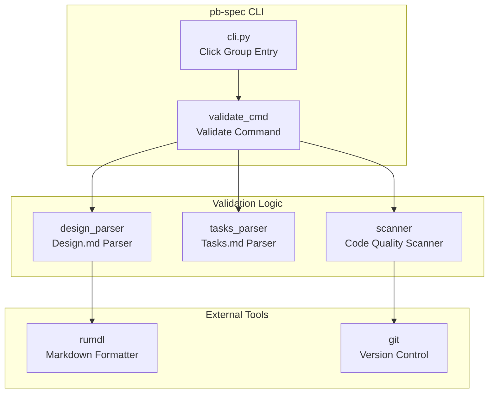
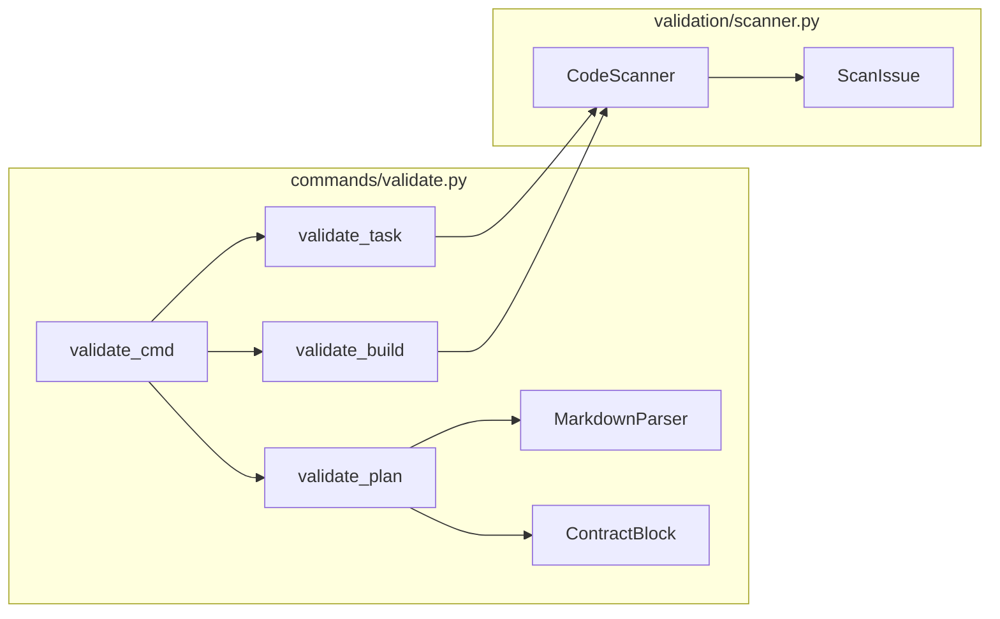
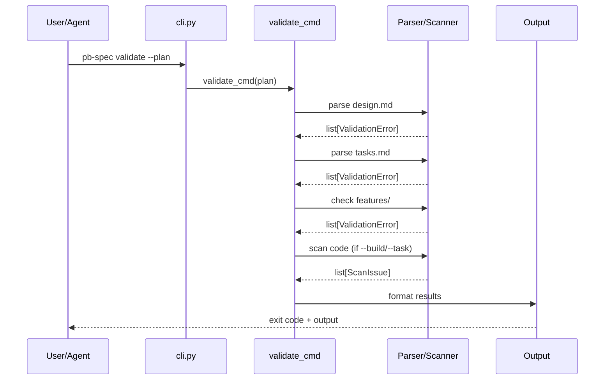

# Design Document: pb-spec (Plan-Build Spec)

| Metadata | Details |
| :--- | :--- |
| **Author** | pb-spec maintainers |
| **Status** | Synced with implementation |
| **Last Updated** | 2026-04-15 |

## 1. Executive Summary

`pb-spec` is a Python CLI tool that validates plan-build workflow artifacts and enforces code quality standards. It provides validation at different stages of the pb-spec workflow:

1. `--plan` validates spec documents generated by `/pb-plan`
2. `--build` validates task completion after `/pb-build`
3. `--task` performs code quality checks before signaling READY_FOR_EVAL

The tool integrates with existing pb-spec workflow as a validation layer, scanning for code quality issues including TODOs, skipped tests, debug artifacts, and mock implementations. It supports multiple programming languages and respects git ignore rules for comprehensive codebase analysis.

---

## 2. Requirements & Goals (EARS Notation)

### 2.1 Problem Statement

The pb-spec workflow produces markdown artifacts (design.md, tasks.md, features/) that must conform to structural contracts before implementation can begin. Without automated validation, agents may produce incomplete or malformed artifacts, leading to failed builds or silent contract violations.

### 2.2 Functional Requirements (EARS)

**Ubiquitous (always true):**

- **[REQ-01]:** The system *shall* validate `design.md` sections when `--plan` is specified.
- **[REQ-02]:** The system *shall* validate `tasks.md` task block structure when `--plan` is specified.
- **[REQ-03]:** The system *shall* check for `.feature` files under `features/` when `--plan` is specified.
- **[REQ-04]:** The system *shall* scan git-modified files for code quality issues when `--task` is specified.
- **[REQ-05]:** The system *shall* output structured error messages with file paths and line numbers.

**State-driven (conditional on state):**

- **[REQ-06]:** While `--build` is specified, the system *shall* verify all tasks are marked DONE with completed checkboxes.
- **[REQ-07]:** While `--plan` is specified with full mode, the system *shall* require all 9 mandatory sections in design.md.

**Event-driven (triggered by event):**

- **[REQ-08]:** When a validation error is found, the system *shall* exit with non-zero status code.
- **[REQ-09]:** When `rumdl` is available, the system *shall* run markdown formatting checks on spec files.

**Unwanted (avoidance):**

- **[REQ-10]:** If `rumdl` is not installed, the system *shall not* fail — formatting checks are skipped gracefully.
- **[REQ-11]:** If a spec directory does not exist, the system *shall not* guess or create one — it shall report the error.

**Exception (conditional exception):**

- **[REQ-12]:** Where a verification field contains `N/A`, the system *shall* accept it only when accompanied by a brief reason.

### 2.3 Non-Goals

1. Implementing the full pb-spec workflow installation
2. Managing AI platform integrations or skill templates
3. Running model APIs or managing remote state
4. Replacing existing pb-spec workflow tools
5. Introducing new workflow commands or schema formats

### 2.4 Code Simplification Constraints

- **Behavior Preservation Boundary:** Validation logic must not modify source files — read-only operations only.
- **Repo Standards To Follow:** Python 3.12+, Click CLI, dataclasses, regex-based parsing. Match existing patterns in `src/pb_spec/`.
- **Readability Priorities:** Prefer explicit branching over clever one-liners. Keep validation rules readable as a manifest.
- **Refactoring Non-Goals:** Do not refactor unrelated scanner or CLI code while modifying validation logic.

---

## 3. Requirements Coverage Matrix

| Requirement ID | EARS Pattern | Covered In Design | Scenario Coverage | Task Coverage | Status / Rationale |
| :--- | :--- | :--- | :--- | :--- | :--- |
| `REQ-01` | Ubiquitous | §4.1 Plan Validation | validate.feature | N/A | Covered |
| `REQ-02` | Ubiquitous | §4.1 Plan Validation | validate.feature | N/A | Covered |
| `REQ-03` | Ubiquitous | §4.1 Plan Validation | validate.feature | N/A | Covered |
| `REQ-04` | Ubiquitous | §4.3 Task Validation | validate.feature | N/A | Covered |
| `REQ-05` | Ubiquitous | §7 Error Handling | validate.feature | N/A | Covered |
| `REQ-06` | State-driven | §4.2 Build Validation | validate.feature | N/A | Covered |
| `REQ-07` | State-driven | §6.2 Contract | N/A | N/A | Covered |
| `REQ-08` | Event-driven | §7.1 Exception Hierarchy | validate.feature | N/A | Covered |
| `REQ-09` | Event-driven | §6.3 Safety Mechanisms | N/A | N/A | Covered |
| `REQ-10` | Unwanted | §6.3 Safety Mechanisms | validate.feature | N/A | Covered |
| `REQ-11` | Unwanted | §7.1 Exception Hierarchy | validate.feature | N/A | Covered |
| `REQ-12` | Exception | §7.2 Validation Contracts | N/A | N/A | Covered |

---

## 4. Architecture Overview (C4 Model + Mermaid)

### 4.1 System Context (C4 Level 1)


```mermaid
C4Context
    title System Context Diagram for pb-spec

    Person(agent, "AI Agent", "Runs /pb-plan, /pb-build, /pb-refine")
    Person(dev, "Developer", "Runs CLI commands")

    System(pbspec, "pb-spec", "Validates workflow artifacts and code quality")

    System_Ext(rumdl, "rumdl", "Markdown formatter (optional)")
    System_Ext(git, "Git", "Version control")

    Rel(agent, pbspec, "Validates specs via pb-spec validate")
    Rel(dev, pbspec, "Runs validation checks")
    Rel(pbspec, rumdl, "Formats markdown (optional)")
    Rel(pbspec, git, "Reads file lists and status")
```

### 4.2 Container Diagram (C4 Level 2)


```mermaid
graph TD
    subgraph "pb-spec CLI"
        CLI[cli.py<br/>Click Group Entry]
        VAL[validate_cmd<br/>Validate Command]
    end

    subgraph "Validation Logic"
        DP[design_parser<br/>Design.md Parser]
        TP[tasks_parser<br/>Tasks.md Parser]
        SC[scanner<br/>Code Quality Scanner]
    end

    subgraph "External Tools"
        RUMDL[rumdl<br/>Markdown Formatter]
        GIT[git<br/>Version Control]
    end

    CLI --> VAL
    VAL --> DP
    VAL --> TP
    VAL --> SC
    DP --> RUMDL
    SC --> GIT
```

### 4.3 Component Diagram (C4 Level 3)


```mermaid
graph LR
    subgraph "commands/validate.py"
        VC[validate_cmd]
        VP[validate_plan]
        VB[validate_build]
        VT[validate_task]
        MP[MarkdownParser]
        CB[ContractBlock]
    end

    subgraph "validation/scanner.py"
        CS[CodeScanner]
        SI[ScanIssue]
    end

    VC --> VP
    VC --> VB
    VC --> VT
    VP --> MP
    VP --> CB
    VT --> CS
    VB --> CS
    CS --> SI
```

### 4.4 Key Design Principles

1. **Read-only validation:** The tool never modifies source files — only reads and reports.
2. **Graceful degradation:** Optional tools (rumdl) fail safely without breaking validation.
3. **Contract-driven:** Validation rules are defined by `contract.md` — the tool enforces the contract.
4. **Git-aware:** File discovery uses `git ls-files` for accurate, ignore-respecting scanning.

### 4.5 Existing Components to Reuse

| Component | Location | How to Reuse |
| :--- | :--- | :--- |
| Click CLI framework | `src/pb_spec/cli.py` | Extend with new subcommands |
| MarkdownParser | `src/pb_spec/commands/validate.py` | Reuse for parsing any spec markdown |
| ContractBlock | `src/pb_spec/commands/validate.py` | Reuse for structured block validation |
| CodeScanner | `src/pb_spec/validation/scanner.py` | Reuse for code quality scanning |

---

## 5. Architecture Decisions (MADR Format)

### AD-01: Use Click as CLI Framework

- **Status:** `Accepted`
- **Date:** 2026-03-19

**Context:**
> The CLI needs subcommands (`validate --plan`, `--build`, `--task`) with flag-based mode selection. Python offers argparse, click, and typer.

**Decision:**
> Use Click as the CLI framework. It provides declarative command definition, automatic help generation, and composable option groups.

**Consequences:**

- Positive: Clean command definitions, built-in help, easy testing via CliRunner.
- Negative: Additional runtime dependency (though minimal).
- Neutral: Consistent with Python ecosystem conventions.

### AD-02: Regex-based Markdown Parsing over AST

- **Status:** `Accepted`
- **Date:** 2026-03-19

**Context:**
> Markdown parsing needs to extract headings, fields, task blocks, and contract blocks. Options include AST-based parsers (markdown-it, mistune) or regex.

**Decision:**
> Use compiled regex patterns for markdown parsing. Patterns are defined at module level for performance. This avoids heavy dependencies while providing sufficient accuracy for the structured markdown format.

**Consequences:**

- Positive: Zero additional dependencies, fast execution, easy to maintain.
- Negative: Fragile if markdown format changes significantly; no lossless editing support.
- Neutral: Acceptable trade-off for a validation tool that reads, not writes, markdown.

### AD-03: Dataclasses over Pydantic for Structured Types

- **Status:** `Accepted`
- **Date:** 2026-03-19

**Context:**
> Validation results, task blocks, and scan issues need structured representation. Options include dataclasses, pydantic, or msgspec.

**Decision:**
> Use stdlib dataclasses with frozen=True for immutable types. Keeps the dependency footprint minimal for a CLI tool.

**Consequences:**

- Positive: No external dependency, stdlib support, frozen immutability.
- Negative: No automatic validation, serialization, or schema generation.
- Neutral: Acceptable for a tool that produces human-readable output, not structured APIs.

### AD-04: Git-aware File Discovery

- **Status:** `Accepted`
- **Date:** 2026-03-19

**Context:**
> The scanner needs to discover source files while respecting .gitignore. Options include os.walk with manual ignore logic, or shelling out to `git ls-files`.

**Decision:**
> Use `git ls-files` as the primary file discovery method with os.walk fallback for non-git environments. This ensures .gitignore rules are automatically respected.

**Consequences:**

- Positive: Correct ignore handling, respects project conventions, no manual ignore patterns.
- Negative: Requires git to be installed; fallback needed for non-git contexts.
- Neutral: Acceptable for a tool designed for git-managed projects.

---

## 6. Data Models (DBML)

```dbml
Table validation_results {
  id integer [pk, increment]
  mode varchar [not null]  // 'plan', 'build', 'task'
  spec_dir varchar
  is_valid boolean [not null]
  errors json
  warnings json
  created_at timestamp [default: `now()`]
}

Table task_blocks {
  id integer [pk, increment]
  task_id varchar [not null]  // e.g., '1.1', '2.3'
  name varchar [not null]
  status varchar [not null]  // 'TODO', 'IN_PROGRESS', 'DONE', etc.
  loop_type varchar  // 'BDD+TDD', 'TDD-only'
  spec_dir varchar [not null]
}

Table scan_issues {
  id integer [pk, increment]
  file_path varchar [not null]
  line_number integer
  issue_type varchar [not null]  // 'skipped_test', 'not_implemented', 'todo', 'debug'
  message varchar [not null]
  language varchar
}
```

---

## 7. Interface Contracts (Type Signatures)

### 7.1 Core Validation Interface

```python
from dataclasses import dataclass, field
from enum import Enum


class ValidationMode(Enum):
    PLAN = "plan"
    BUILD = "build"
    TASK = "task"


@dataclass(frozen=True)
class ValidationError:
    file: str
    line: int | None = None
    message: str
    severity: str = "error"  # 'error', 'warning', 'info'


@dataclass(frozen=True)
class ValidationResult:
    mode: ValidationMode
    spec_dir: str | None
    is_valid: bool
    errors: tuple[ValidationError, ...] = ()
    warnings: tuple[ValidationError, ...] = ()


class DesignParser:
    def parse(self, content: str, mode: str = "full") -> list[ValidationError]:
        """Parse design.md and return validation errors."""
        ...


class TasksParser:
    def parse(self, content: str) -> list[ValidationError]:
        """Parse tasks.md and return validation errors."""
        ...


class CodeScanner:
    def scan(self, files: list[str]) -> list[ScanIssue]:
        """Scan files for code quality issues."""
        ...
```

### 7.2 Exception Hierarchy

```python
class ValidationError(Exception):
    """Base exception for all validation errors."""
    pass


class SpecNotFoundError(ValidationError):
    """Raised when spec directory is missing."""
    pass


class FileReadError(ValidationError):
    """Raised when spec files cannot be read."""
    pass


class ContractViolationError(ValidationError):
    """Raised when markdown contract is violated."""
    pass
```

---

## 8. Detailed Design

### 8.1 Module Structure

```text
src/pb_spec/
├── __init__.py                 # Version from metadata
├── cli.py                      # Click CLI entry point
├── commands/
│   ├── __init__.py
│   └── validate.py             # Validate command implementation
└── validation/
    ├── __init__.py
    └── scanner.py              # Code quality scanner
```

### 8.2 Logic Flow


```mermaid
sequenceDiagram
    participant U as User/Agent
    participant CLI as cli.py
    participant V as validate_cmd
    participant P as Parser/Scanner
    participant O as Output

    U->>CLI: pb-spec validate --plan
    CLI->>V: validate_cmd(plan)
    V->>P: parse design.md
    P-->>V: list[ValidationError]
    V->>P: parse tasks.md
    P-->>V: list[ValidationError]
    V->>P: check features/
    P-->>V: list[ValidationError]
    V->>P: scan code (if --build/--task)
    P-->>V: list[ScanIssue]
    V->>O: format results
    O-->>U: exit code + output
```

### 8.3 Validation Modes

| Mode | Purpose | Scope |
| :--- | :--- | :--- |
| `--plan` | Validate spec documents after `/pb-plan` | `design.md`, `tasks.md`, `features/` structure |
| `--build` | Validate task completion after `/pb-build` | Task status, step completion, code quality |
| `--task` | Code quality check before READY_FOR_EVAL | Git-modified files or full codebase scan |

---

## 9. Verification & Testing Strategy

### 9.1 Unit Testing

- CLI interface and argument parsing
- File discovery and git integration
- Validation logic for design.md, tasks.md, features/
- Code scanner pattern matching
- Exception handling and error cases

### 9.2 BDD Acceptance Testing

| Scenario ID | Feature File | Command | Success Criteria |
| :--- | :--- | :--- | :--- |
| **BDD-01** | `features/validate.feature` | `uv run behave` | All scenarios pass |

### 9.3 Critical Path Verification

| Verification Step | Command | Success Criteria |
| :--- | :--- | :--- |
| **VP-01** | `uv run ruff check` | exit 0, no errors |
| **VP-02** | `uv run ty check` | exit 0, no errors |
| **VP-03** | `uv run pytest` | all tests pass |
| **VP-04** | `uv run behave` | all scenarios pass |
| **VP-05** | `uv run pb-spec validate --help` | shows help text |

---

## 10. Error Handling

### 10.1 Exception Hierarchy

- `ValidationError`: Base exception for all validation errors
- `SpecNotFoundError`: When spec directory is missing
- `FileReadError`: When spec files cannot be read
- `ContractViolationError`: When markdown contract is violated

### 10.2 Safety Mechanisms

1. **Git-aware scanning:** Respects .gitignore, excludes irrelevant directories
2. **Timeout protection:** All external commands have 60-second timeouts
3. **Graceful degradation:** Optional tools (rumdl) fail safely without breaking validation
4. **Idempotent operations:** Validation is read-only, never modifies files

---

## 11. Implementation Plan

- [x] **Phase 1: Foundation** — CLI entry point, Click group, basic validate command
- [x] **Phase 2: Core Logic** — Markdown parser, contract block parser, validation rules
- [x] **Phase 3: Scanner** — Code quality scanner with multi-language support
- [x] **Phase 4: Integration** — Wire validation modes, add rumdl integration
- [ ] **Phase 5: Polish** — Additional validation rules, performance optimization

---

## 12. Cross-Functional Concerns

- **Performance:** For very large codebases, consider implementing parallel scanning or incremental validation
- **Extensibility:** Additional programming languages can be added by extending scanner patterns
- **Configuration:** Currently hardcoded patterns; future versions may support configurable rule sets
