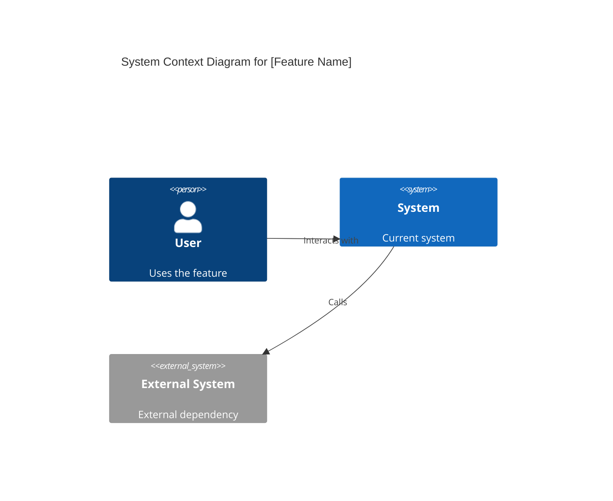
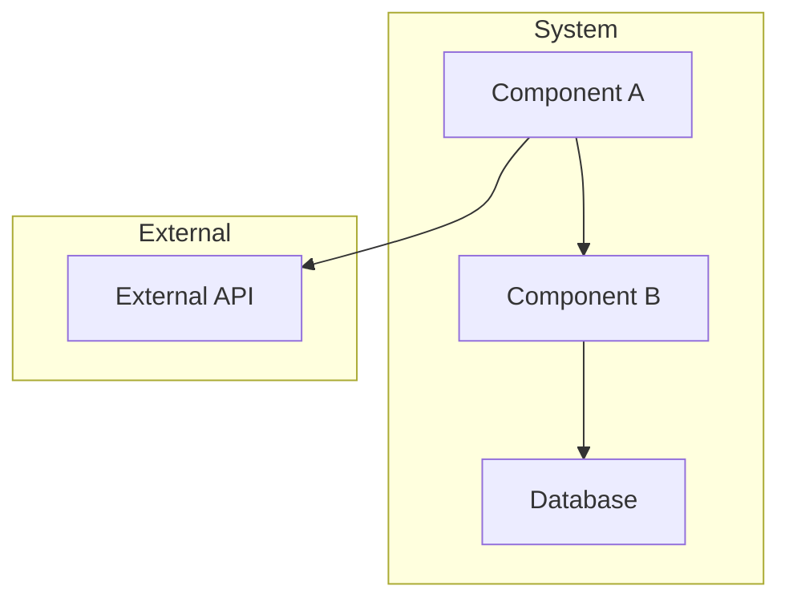
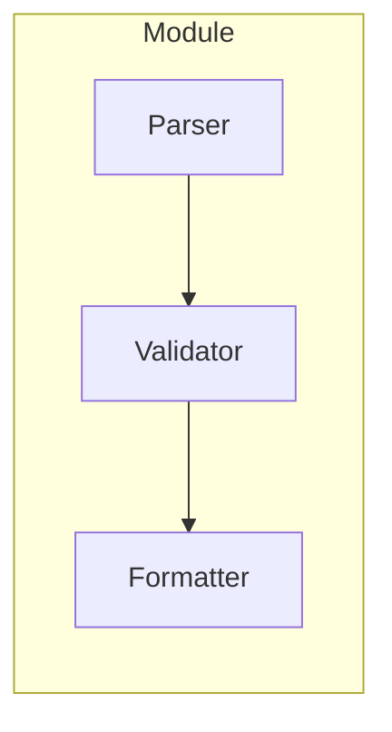
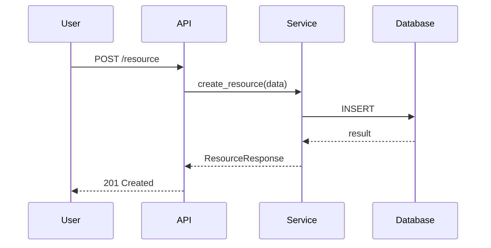

# Design Document: [Feature Name]

| Metadata | Details |
| :--- | :--- |
| **Author** | [Name or "pb-plan agent"] |
| **Status** | Draft |
| **Created** | YYYY-MM-DD |
| **Reviewers** | [Name 1], [Name 2] |
| **Related Issues** | #[Issue ID] or N/A |

## Executive Summary

> 2-3 sentences: What problem are we solving? What is the proposed solution?

**Problem:** ...
**Solution:** ...

---

## 2. Source Inputs & Normalization

### 2.1 Source Materials

> What did the planner consume? Capture raw design docs, rough notes, partial design drafts, issue threads, transcripts, or mixed-format requirement sources. The planner should accept arbitrary format input instead of requiring a special prompt recipe.

### 2.2 Normalization Approach

> Explain how the raw input was normalized into a source requirement ledger, what ambiguities were resolved via repo evidence, and which assumptions remain explicit. If subagent findings were used during intake or reconciliation, summarize the subagent roles and the evidence they contributed.

### 2.3 Source Requirement Ledger

| Requirement ID | Source Summary | Type | Notes |
| :--- | :--- | :--- | :--- |
| `R1` | `[Requirement or constraint extracted from the source]` | `Functional / Constraint / Non-goal / Assumption trigger` | `[Any wording that must be preserved]` |

---

## Requirements & Goals

> All acceptance criteria use **EARS (Easy Approach to Requirements Syntax)** — 5 sentence patterns that eliminate ambiguity and produce machine-checkable acceptance criteria.

### 3.1 Problem Statement

> Describe current pain points or missing functionality. Be specific.

### 3.2 Functional Requirements (EARS)

> Each requirement uses one of the 5 EARS patterns. Tag each with its pattern type.

**Ubiquitous (always true):**

- **[REQ-01]:** The system *shall* [action] when [trigger].
- **[REQ-02]:** The system *shall* [action] when [trigger].

**State-driven (conditional on state):**

- **[REQ-03]:** While [state], the system *shall* [action].

**Event-driven (triggered by event):**

- **[REQ-04]:** When [event], the system *shall* [action].

**Unwanted (avoidance):**

- **[REQ-05]:** If [condition], the system *shall not* [action].

**Exception (conditional exception):**

- **[REQ-06]:** Where [condition], the system *shall* [alternative action].

### 3.3 Non-Functional Goals

> Performance, reliability, security, observability, etc.

- **Performance:** ...
- **Reliability:** ...
- **Security:** ...

### 3.4 Out of Scope

> What is explicitly NOT being done. Prevents scope creep.

### 3.5 Assumptions

> Any assumptions or constraints. List decisions made when requirements were ambiguous.

### 3.6 Code Simplification Constraints

> Document the maintainability rules that should shape implementation decisions.

- **Behavior Preservation Boundary:** What must remain unchanged unless an acceptance scenario or explicit requirement says otherwise.
- **Repo Standards To Follow:** Language- and framework-specific coding standards inferred from `AGENTS.md`, `CLAUDE.md`, and the live codebase. Only include standards that are actually relevant to this repo.
- **Readability Priorities:** Prefer explicit control flow, clear naming, reduced nesting, and removal of redundant abstractions when that improves maintainability.
- **Refactoring Non-Goals:** Unrelated cleanup stays out of scope unless the design explicitly justifies a broader refactor.
- **Clarity Guardrails:** Avoid dense or clever rewrites. In languages where it applies, avoid nested ternary operators in favor of clearer branching.

---

## 4. Requirements Coverage Matrix

> Reconcile the normalized source requirements against the generated spec before finalizing the plan.

| Requirement ID | EARS Pattern | Covered In Design | Scenario Coverage | Task Coverage | Status / Rationale |
| :--- | :--- | :--- | :--- | :--- | :--- |
| `R1` | `[Ubiquitous/State-driven/Event-driven/Unwanted/Exception]` | `[Section references]` | `[Feature/scenario names or N/A]` | `[Task IDs or N/A]` | `[Covered / Out of scope / Deferred / Assumption-bound]` |

---

## Architecture Overview

> Architecture is expressed using **C4 Model** (Context, Containers, Components, Code) rendered in **Mermaid.js** syntax. Agents parse Mermaid directly — no image files.

### 5.1 System Context (C4 Level 1)

> How does this feature fit into the existing system? Show external actors and systems.



### 5.2 Container Diagram (C4 Level 2)

> Major building blocks and their interactions.



### 5.3 Component Diagram (C4 Level 3)

> Internal components of the primary container. Show key responsibilities and data flow.



### 5.4 Key Design Principles

> Core ideas guiding this design. Examples: "Separation of concerns", "Fail-fast", "Backward-compatible API".

### 5.5 Existing Components to Reuse

> **Mandatory:** Before designing new modules, search the existing codebase for reusable components. List any existing utilities, clients, base classes, or patterns that this feature MUST reuse instead of reimplementing.

| Component | Location | How to Reuse |
| :--- | :--- | :--- |
| [e.g., RedisClient] | [src/utils/redis.py] | [Use for all cache operations] |
| [e.g., BaseModel] | [src/models/base.py] | [Extend for new data models] |

> If no reusable components exist, state "No existing components identified for reuse" and explain why.

### 5.6 Project Identity Alignment

> If the repository appears to come from a template/scaffold, identify any generic crate/package/module names that must be renamed to match the current project or product identity before feature work is complete.

| Current Identifier | Location | Why It Is Generic or Misaligned | Planned Name / Action |
| :--- | :--- | :--- | :--- |
| `[e.g., template_app]` | `[e.g., pyproject.toml, src/template_app/]` | `[Placeholder copied from scaffold]` | `[Rename to current project package]` |

> If no identity cleanup is needed, state "No template identity mismatches detected.".

---

## Architecture Decisions

> Decisions follow **MADR (Markdown Any Decision Records)** — lightweight ADR format with `[Context]`, `[Decision]`, `[Consequences]`. Each decision is a numbered record that agents cannot override without explicit re-evaluation.

### AD-01: [Decision Title]

- **Status:** `Proposed` / `Accepted` / `Deprecated` / `Superseded by AD-XX`
- **Date:** YYYY-MM-DD

**Context:**
> What is the issue that motivates this decision? What forces are at play (technical, political, social, project-related)?

**Decision:**
> What is the change being proposed or decided? State the decision clearly and concisely.

**Consequences:**
> What becomes easier or more difficult because of this change? What trade-offs are introduced?

- Positive: ...
- Negative: ...
- Neutral: ...

### AD-02: [Decision Title]

- **Status:** `Proposed` / `Accepted` / `Deprecated` / `Superseded by AD-XX`
- **Date:** YYYY-MM-DD

**Context:**
> ...

**Decision:**
> ...

**Consequences:**
> ...

### 5.7 Architecture Decision Snapshot Inputs

> List which repo-level decisions from `AGENTS.md`, docs, or existing code this design is inheriting.

### 5.8 SRP / DIP Check

> For changes >200 lines or introducing new module boundaries:
- **SRP Check:** Explain how responsibilities stay isolated and which modules should not absorb new concerns.
- **DIP Check:** Identify the seams where dependencies must be inverted.
- **Dependency Injection Plan:** All external dependencies should flow through interfaces or abstract classes unless the repo already has a documented alternative seam.

### 5.9 BDD/TDD Strategy

> Describe how this feature will use outside-in development. Define the business-facing Gherkin loop and the supporting TDD loop.

- **BDD Runner:** `[e.g., @cucumber/cucumber | behave | cucumber]`
- **BDD Command:** `[e.g., npm exec cucumber-js features/auth.feature]`
- **Unit Test Command:** `[e.g., pytest tests/auth/test_service.py -v]`
- **Property Test Tool:** `[e.g., fast-check | Hypothesis | proptest | N/A with reason]`
- **Fuzz Test Tool:** `[e.g., jazzer.js | Atheris | cargo-fuzz | N/A with reason]`
- **Benchmark Tool:** `[e.g., Vitest Bench | pytest-benchmark | criterion | N/A with reason]`
- **Outer Loop:** `[Which`.feature`scenarios prove the behavior works end-to-end]`
- **Inner Loop:** `[Which unit/component tests will drive the underlying implementation]`
- **Step Definition Location:** `[e.g., features/steps/, tests/bdd/, crates/app/tests/]`

### 5.10 BDD Scenario Inventory

> List every scenario that should be planned as a first-class acceptance artifact.

| Feature File | Scenario | Business Outcome | Primary Verification | Supporting TDD Focus |
| :--- | :--- | :--- | :--- | :--- |
| `features/[feature-name].feature` | `[Scenario Name]` | `[User-visible result]` | `[BDD command or acceptance check]` | `[Unit/component logic to drive with TDD]` |

### 5.11 Simplification Opportunities in Touched Code

> Identify the specific cleanup that should happen alongside the feature without broadening scope.

| Area | Current Complexity or Smell | Planned Simplification | Why It Preserves or Clarifies Behavior |
| :--- | :--- | :--- | :--- |
| `[e.g., version parser]` | `[Nested branching and duplicate normalization paths]` | `[Flatten control flow and centralize normalization]` | `[Keeps existing outputs while making the logic easier to reason about]` |

---

## Data Models

> Data models are expressed using **DBML** or **Prisma Schema** — structured DSL with strict types, relationships, and index definitions. Natural language table descriptions are forbidden.

### 7.1 Data Model Definition

```dbml
// DBML format (https://dbml.dbdiagram.io)
Table users {
  id integer [pk, increment]
  email varchar [unique, not null]
  name varchar
  created_at timestamp [default: `now()`]
  updated_at timestamp
}

Table posts {
  id integer [pk, increment]
  user_id integer [ref: > users.id, not null]
  title varchar [not null]
  body text
  status varchar [default: 'draft']
  created_at timestamp [default: `now()`]
}

// Alternative: Prisma Schema format
// model User {
//   id        Int      @id @default(autoincrement())
//   email     String   @unique
//   name      String?
//   posts     Post[]
//   createdAt DateTime @default(now())
// }
//
// model Post {
//   id        Int      @id @default(autoincrement())
//   userId    Int
//   user      User     @relation(fields: [userId], references: [id])
//   title     String
//   body      String?
//   status    String   @default("draft")
//   createdAt DateTime @default(now())
// }
```

### 7.2 Relationships

| From | Type | To | Description |
| :--- | :--- | :--- | :--- |
| `users` | 1:N | `posts` | A user has many posts |
| `posts` | N:1 | `users` | A post belongs to one user |

### 7.3 Indexes

| Table | Columns | Type | Purpose |
| :--- | :--- | :--- | :--- |
| `users` | `email` | UNIQUE | Login lookup |
| `posts` | `user_id` | INDEX | User's posts query |
| `posts` | `status, created_at` | INDEX | Feed query |

### 7.4 Migration Notes

> Any schema changes, data migrations, or backward-compatibility concerns.

---

## Interface Contracts

> All module boundaries and external APIs are defined as **type signatures** before implementation. Agents use these as compile-time contracts — parameter mismatches are caught at design time, not runtime.

### 8.1 Public API (External)

> REST endpoints, CLI commands, or RPC interfaces this feature exposes.

```yaml
# OpenAPI-style contract (simplified)
paths:
  /api/v1/resource:
    post:
      summary: Create resource
      requestBody:
        required: true
        content:
          application/json:
            schema:
              $ref: '#/components/schemas/CreateResourceRequest'
      responses:
        '201':
          description: Resource created
          content:
            application/json:
              schema:
                $ref: '#/components/schemas/ResourceResponse'
        '400':
          description: Validation error

components:
  schemas:
    CreateResourceRequest:
      type: object
      required: [name]
      properties:
        name:
          type: string
          minLength: 1
          maxLength: 255
        description:
          type: string

    ResourceResponse:
      type: object
      properties:
        id:
          type: integer
        name:
          type: string
        created_at:
          type: string
          format: date-time
```

### 8.2 Internal Module Contracts (Type Signatures)

> Internal interfaces, protocols, or abstract classes. Use language-native type syntax.

```python
# Python Protocol example
class Validator(Protocol):
    def validate(self, data: ResourceData) -> ValidationResult:
        """Validate resource data against schema."""
        ...

class Formatter(Protocol):
    def format(self, result: ValidationResult) -> str:
        """Format validation result for output."""
        ...

# Data classes
@dataclass(frozen=True)
class ResourceData:
    name: str
    description: str | None = None

@dataclass(frozen=True)
class ValidationResult:
    is_valid: bool
    errors: list[str]
    warnings: list[str]
```

```typescript
// TypeScript interface example
interface Validator {
  validate(data: ResourceData): ValidationResult;
}

interface Formatter {
  format(result: ValidationResult): string;
}

// Type definitions
type ResourceData = {
  name: string;
  description?: string;
};

type ValidationResult = {
  isValid: boolean;
  errors: string[];
  warnings: string[];
};
```

```rust
// Rust trait example
pub trait Validator {
    fn validate(&self, data: &ResourceData) -> ValidationResult;
}

pub trait Formatter {
    fn format(&self, result: &ValidationResult) -> String;
}

#[derive(Debug, Clone)]
pub struct ResourceData {
    pub name: String,
    pub description: Option<String>,
}

#[derive(Debug, Clone)]
pub struct ValidationResult {
    pub is_valid: bool,
    pub errors: Vec<String>,
    pub warnings: Vec<String>,
}
```

### 8.3 Error Contracts

> Structured error types returned by APIs and internal modules.

```python
@dataclass(frozen=True)
class ServiceError:
    code: str          # e.g., "VALIDATION_FAILED", "NOT_FOUND"
    message: str       # Human-readable description
    details: dict[str, str] | None = None  # Field-level errors
```

---

## Detailed Design

### 9.1 Module Structure

> File/directory layout for the new or modified code. If the repo still exposes scaffold placeholders, show the project-matching module/package/crate names after the planned rename.

```text
src/
├── module_name/
│   ├── __init__.py
│   ├── core.py
│   ├── models.py
│   └── utils.py
```

### 9.2 Logic Flow

> Describe key workflows, state transitions, or processing pipelines. Use Mermaid sequence or flow diagrams for clarity.



### 9.3 Configuration

> Any new config values, environment variables, or feature flags introduced.

### 9.4 Error Handling

> Error types, failure modes, and recovery strategy.

### 9.5 Maintainability Notes

> Call out any implementation guardrails that keep the change readable and easy to extend.

- Prefer focused helpers over oversized multi-purpose functions when a split improves clarity.
- Do not remove abstractions that the codebase already uses effectively for separation of concerns.
- Keep refactor scope limited to touched modules unless the design explicitly expands it.

---

## Verification & Testing Strategy

### 10.1 Unit Testing

> What pure logic to test. Scope and tooling.
>
> Include regression checks that prove any planned simplification preserves behavior, not just happy-path outcomes.

### 10.2 Property Testing

> Identify where example-based tests leave too much input space uncovered. Use the language-appropriate property-testing tool (`Hypothesis`, `fast-check`, or `proptest`) unless you can justify that the logic is too trivial or already fully covered by a smaller deterministic domain.

| Target Behavior | Why Property Testing Helps | Tool / Command | Planned Invariants |
| :--- | :--- | :--- | :--- |
| `[e.g., version string normalization]` | `[Large combinatorial input space]` | `[e.g., uv run pytest tests/test_version_properties.py -q]` | `[Round-trip, idempotence, monotonicity, etc.]` |

### 10.3 Integration Testing

> How modules work together. Mock strategies, sandbox environments.

### 10.4 BDD Acceptance Testing

> Which `.feature` files and scenarios must fail first and then pass. Include the exact BDD runner command.

| Scenario ID | Feature File | Command | Success Criteria |
| :--- | :--- | :--- | :--- |
| **BDD-01** | `[e.g., features/auth.feature]` | `[e.g., npm exec cucumber-js features/auth.feature]` | `[e.g., Scenario passes with 0 failed steps]` |

### 10.5 Robustness & Performance Testing

> Plan these only when the task profile requires them.

| Test Type | When It Is Required | Tool / Command | Planned Coverage or Reason Not Needed |
| :--- | :--- | :--- | :--- |
| **Fuzz** | `[Parser/protocol/unsafe/untrusted-input paths only]` | `[e.g., cargo fuzz run parser]` | `[Crash-safety target, or N/A with reason]` |
| **Benchmark** | `[Explicit latency/throughput/hot-path requirements only]` | `[e.g., uv run pytest tests/benchmarks/test_cli.py --benchmark-only]` | `[Regression budget, or N/A with reason]` |

### 10.6 Critical Path Verification (The "Harness")

> Define the exact command(s) or script(s) that prove this feature works end-to-end. The `pb-build` agent will use these to verify the final result. This acts as the acceptance test for the entire feature.

| Verification Step | Command | Success Criteria |
| :--- | :--- | :--- |
| **VP-01** | `[e.g., python scripts/verify_auth.py]` | `[e.g., "Output contains 'Authenticated'"]` |
| **VP-02** | `[e.g., curl -v http://localhost:8000/health]` | `[e.g., "Response code 200"]` |
| **VP-03** | `[e.g., pytest tests/ -v --tb=short]` | `[e.g., "All tests pass, 0 failures"]` |

### 10.7 Validation Rules

| Test Case ID | EARS Requirement | Action | Expected Outcome | Verification Method |
| :--- | :--- | :--- | :--- | :--- |
| **TC-01** | `[REQ-XX]` | [Action] | [Expected result] | [How to verify] |
| **TC-02** | `[REQ-XX]` | [Action] | [Expected result] | [How to verify] |

---

## Implementation Plan

> Phase checklist — high-level roadmap mapping to tasks.md.

- [ ] **Phase 1: Foundation** — Scaffolding, config, core types
- [ ] **Phase 2: Core Logic** — Primary feature implementation
- [ ] **Phase 3: Integration** — Wire into existing system, end-to-end flow
- [ ] **Phase 4: Polish** — Tests, docs, error handling, CI

---

## 12. Cross-Functional Concerns

> Security review, backward compatibility, migration plan, documentation updates, monitoring/alerting, or rollback strategy — if applicable.
