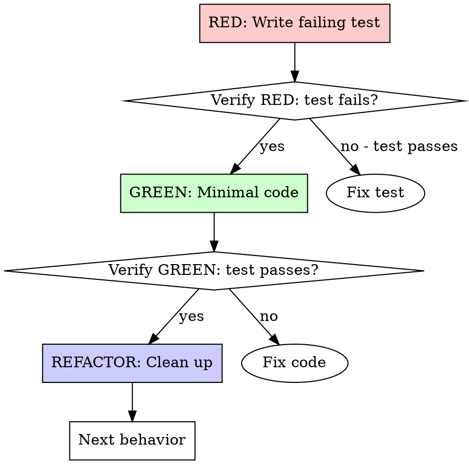

# pb-test-driven-development

Write failing tests first, then implement to make them pass. Red → Green → Refactor.

**Core principle:** If you didn't watch the test fail, you don't know if it tests the right thing.

**Violating the letter of the rules is violating the spirit of the rules.**

## The Iron Law

```
NO PRODUCTION CODE WITHOUT A FAILING TEST FIRST
```

Write code before the test? Delete it. Start over.

**No exceptions:**

- Don't keep it as "reference"
- Don't "adapt" it while writing tests
- Don't look at it
- Don't skim it for ideas
- Delete means delete — remove the files, revert the changes, start from a clean state

## When to Use

**Always:**

- New features
- Bug fixes
- Refactoring
- Behavior changes

**Exceptions (ask user):**

- Throwaway prototypes
- Generated code
- Configuration files

Thinking "skip TDD just this once"? Stop. That's rationalization.

## Red-Green-Refactor



### RED - Write Failing Test

Write one minimal test showing what should happen.

**Good:**
```python
def test_retries_failed_operations_3_times():
    attempts = 0
    def operation():
        nonlocal attempts
        attempts += 1
        if attempts < 3:
            raise ValueError("fail")
        return "success"

    result = retry_operation(operation)

    assert result == "success"
    assert attempts == 3
```
Clear name, tests real behavior, one thing.

**Bad:**
```python
def test_retry_works():
    mock = Mock(side_effect=[ValueError, ValueError, "success"])
    result = retry_operation(mock)
    assert mock.call_count == 3
```
Vague name, tests mock not code.

**Requirements:**

- One behavior
- Clear name
- Real code (no mocks unless unavoidable)

### Bug Fix: Reproduce First

For bugs, the RED phase doubles as a reproducer. Don't fix without confirming the bug exists.

**User reports:** "Sorting breaks when there are duplicate scores"

**Wrong:** Immediately changes sort logic.

**Right:**
```python
# 1. RED: Write test that exposes the bug
def test_sort_with_duplicate_scores():
    scores = [
        {'name': 'Alice', 'score': 100},
        {'name': 'Bob', 'score': 100},
        {'name': 'Charlie', 'score': 90},
    ]
    result = sort_scores(scores)
    assert result[0]['score'] == 100
    assert result[1]['score'] == 100
    assert result[2]['score'] == 90

# Verify RED: run 10 times → inconsistent ordering → bug confirmed

# 2. GREEN: Fix with stable sort
def sort_scores(scores):
    return sorted(scores, key=lambda x: (-x['score'], x['name']))

# Verify GREEN: test passes consistently
```

### Verify RED - Watch It Fail

**MANDATORY. Never skip.**

```bash
uv run pytest tests/path/test.py -v
```

Confirm:

- Test fails (not errors)
- Failure message is expected
- Fails because feature missing (not typos)

**Test passes?** You're testing existing behavior. Fix test.

**Test errors?** Fix error, re-run until it fails correctly.

### GREEN - Minimal Code

Write simplest code to pass the test.

**Good:**
```python
def retry_operation(fn):
    for i in range(3):
        try:
            return fn()
        except Exception:
            if i == 2:
                raise
```
Just enough to pass.

**Bad:**
```python
def retry_operation(fn, max_retries=3, backoff="linear", on_retry=None):
    # YAGNI
```
Over-engineered.

Don't add features, refactor other code, or "improve" beyond the test.

### Verify GREEN - Watch It Pass

**MANDATORY.**

```bash
uv run pytest tests/path/test.py -v
```

Confirm:

- Test passes
- Other tests still pass
- Output pristine (no errors, warnings)

**Test fails?** Fix code, not test.

**Other tests fail?** Fix now.

### REFACTOR - Clean Up

After green only:

- Remove duplication
- Improve names
- Extract helpers

Keep tests green. Don't add behavior.

### Repeat

Next failing test for next feature.

## Why Order Matters

**"I'll write tests after to verify it works"**

Tests written after code pass immediately. Passing immediately proves nothing:

- Might test wrong thing
- Might test implementation, not behavior
- Might miss edge cases you forgot
- You never saw it catch the bug

Test-first forces you to see the test fail, proving it actually tests something.

**"I already manually tested all the edge cases"**

Manual testing is ad-hoc. You think you tested everything but:

- No record of what you tested
- Can't re-run when code changes
- Easy to forget cases under pressure
- "It worked when I tried it" ≠ comprehensive

Automated tests are systematic. They run the same way every time.

**"Deleting X hours of work is wasteful"**

Sunk cost fallacy. The time is already gone. Your choice now:

- Delete and rewrite with TDD (X more hours, high confidence)
- Keep it and add tests after (30 min, low confidence, likely bugs)

The "waste" is keeping code you can't trust.

**"Tests after achieve the same goals - it's spirit not ritual"**

No. Tests-after answer "What does this do?" Tests-first answer "What should this do?"

Tests-after are biased by your implementation. You test what you built, not what's required.

30 minutes of tests after ≠ TDD. You get coverage, lose proof tests work.

**"I'm following the spirit of TDD"**

Violating the letter of the rules is violating the spirit of the rules. There is no "spirit" that permits skipping RED. The entire point is watching the test fail — that's not a ritual, it's the mechanism that proves your test detects the missing behavior. Skip RED, and you have zero evidence your test works.

## Common Rationalizations

| Excuse | Reality |
|--------|---------|
| "Too simple to test" | Simple code breaks. Test takes 30 seconds. |
| "I'll test after" | Tests passing immediately prove nothing. |
| "Tests after achieve same goals" | Tests-after = "what does this do?" Tests-first = "what should this do?" |
| "Already manually tested" | Ad-hoc ≠ systematic. No record, can't re-run. |
| "Deleting X hours is wasteful" | Sunk cost fallacy. Keeping unverified code is technical debt. |
| "Keep as reference, write tests first" | You'll adapt it. That's testing after. Delete means delete. |
| "Need to explore first" | Fine. Throw away exploration, start with TDD. |
| "Test hard = design unclear" | Listen to test. Hard to test = hard to use. |
| "TDD will slow me down" | TDD faster than debugging. Pragmatic = test-first. |
| "Manual test faster" | Manual doesn't prove edge cases. You'll re-test every change. |
| "Existing code has no tests" | You're improving it. Add tests for existing code. |

## Red Flags - STOP and Start Over

These are specific thoughts that mean you are about to violate the Iron Law. Recognize them as danger signals:

- Code before test
- Test after implementation
- Test passes immediately
- Can't explain why test failed
- Tests added "later"
- Rationalizing "just this once"
- "I already manually tested it"
- "Tests after achieve the same purpose"
- "It's about spirit not ritual"
- "Keep as reference" or "adapt existing code"
- "Already spent X hours, deleting is wasteful"
- "TDD is dogmatic, I'm being pragmatic"
- "This is different because..."
- "I'll just check if it works first"
- "The test would be trivial anyway"
- "I know what the code does, I wrote it"

**All of these mean: Delete code. Start over with TDD.**

## Example: Bug Fix

**Bug:** Empty email accepted

**RED**
```python
def test_rejects_empty_email():
    result = submit_form({"email": ""})
    assert result["error"] == "Email required"
```

**Verify RED**
```bash
$ uv run pytest tests/test_form.py::test_rejects_empty_email -v
FAIL: AssertionError: KeyError 'error'
```

**GREEN**
```python
def submit_form(data):
    if not data.get("email", "").strip():
        return {"error": "Email required"}
    # ...
```

**Verify GREEN**
```bash
$ uv run pytest tests/test_form.py::test_rejects_empty_email -v
PASS
```

**REFACTOR**
Extract validation for multiple fields if needed.

## Verification Checklist

Before marking work complete:

- [ ] Every new function/method has a test
- [ ] Watched each test fail before implementing
- [ ] Each test failed for expected reason (feature missing, not typo)
- [ ] Wrote minimal code to pass each test
- [ ] All tests pass
- [ ] Output pristine (no errors, warnings)
- [ ] Tests use real code (mocks only if unavoidable)
- [ ] Edge cases and errors covered

Can't check all boxes? You skipped TDD. Start over.

## When Stuck

| Problem | Solution |
|---------|----------|
| Don't know how to test | Write wished-for API. Write assertion first. |
| Test too complicated | Design too complicated. Simplify interface. |
| Must mock everything | Code too coupled. Use dependency injection. |
| Test setup huge | Extract helpers. Still complex? Simplify design. |

## Debugging Integration

Bug found? Write failing test reproducing it. Follow TDD cycle. Test proves fix and prevents regression.

Never fix bugs without a test.

## Integration with pb-spec

- **pb-build Generator:** Every task in the BDD+TDD loop follows this cycle
- **pb-build TDD-only tasks:** Pure TDD without BDD outer loop
- **Standalone:** Use for any TDD need outside pb-spec workflow
