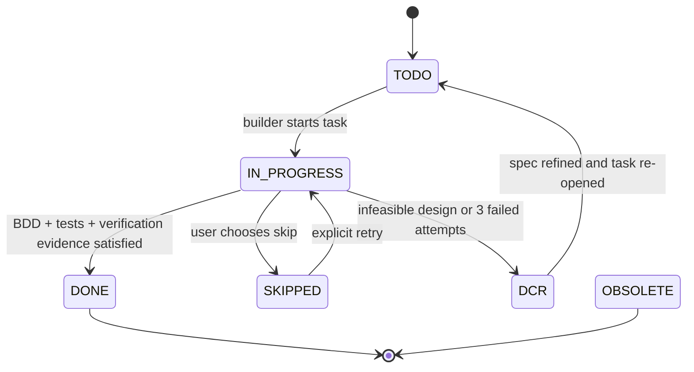

# Design Document: Workflow Type Contracts

| Metadata | Details |
| :--- | :--- |
| **Author** | pb-plan agent |
| **Status** | Draft |
| **Created** | 2026-03-09 |
| **Reviewers** | N/A |
| **Related Issues** | N/A |

## 1. Executive Summary

pb-spec already has the right workflow shape: `/pb-init` captures repo context, `/pb-plan` emits spec artifacts, `/pb-refine` updates them, and `/pb-build` executes them with bounded retries and escalation. The current weakness is not missing workflow steps, but that the handoff artifacts are still mostly prose contracts. This feature hardens the existing markdown artifacts into contract-carrying workflow types so `pb-build` and `pb-refine` reject incomplete or malformed inputs before implementation starts, without adding new commands or replacing the current markdown-first flow.

**Problem:** The current system documents strong workflow rules, but most of those rules are enforced only by prompt wording and scattered regression checks. Illegal workflow states remain representable: a `tasks.md` block can omit critical fields, a build can reach a blocked state with incomplete evidence, and a refine handoff can be structurally ambiguous.

**Solution:** Keep the current `design.md` + `tasks.md` + `features/*.feature` workflow, but make those artifacts carry explicit contract fields in their existing markdown format, add a mandatory `pb-build` spec-validation gate, formalize task state transitions, and tighten `pb-refine` packet requirements around the existing `Design Change Request` and `Build Blocked` markdown blocks.

---

## 2. Requirements & Goals

### 2.1 Problem Statement

The user wants the methodology behind "make illegal states unrepresentable" applied to pb-spec's existing workflow. The target is not a new CLI surface, a new schema language, or a new execution engine. The target is the current plan/refine/build chain itself:

`requirement -> planned spec -> build-eligible spec -> implementation or build-block packet -> refined spec`

Today, that chain is only partially typed. The repository already enforces `Task X.Y` headings, status markers, bounded retries, runtime-verification hooks, architecture decisions, and standardized DCR/build-block packets in prompts and tests. But it does not yet treat the artifact structure itself as a first-class gate that `pb-build` and `pb-refine` must validate before proceeding.

### 2.2 Requirements Coverage Checklist

- **Functional requirement:** Strengthen the existing `pb-init -> pb-plan -> pb-refine -> pb-build` workflow so each stage consumes artifacts that prove their prerequisites were satisfied.
- **Functional requirement:** Keep the current command set and workflow shape. No new commands, no alternate side-channel workflow.
- **Functional requirement:** Preserve the existing markdown-driven artifact format used by `pb-plan`, `pb-build`, and `pb-refine`.
- **Functional requirement:** Add a mandatory pre-execution contract validation phase to `pb-build`.
- **Functional requirement:** Make task lifecycle rules explicit and reject illegal task closure paths.
- **Functional requirement:** Make `Build Blocked` and `Design Change Request` handoffs structurally complete and reviewable.
- **Constraint:** Keep compatibility with current `Task X.Y` parsing, `Scenario Coverage`, `Loop Type`, `BDD Verification`, `Verification`, and status-marker conventions already used by the repo.
- **Constraint:** Ground changes in the current repo implementation, not in an imagined runtime parser that does not exist.
- **Constraint:** Enforcement must work through existing prompt/template assets and their tests because pb-spec currently installs prompt content rather than executing workflow logic itself.
- **Maintainability requirement:** Prefer explicit contract fields over parallel YAML or JSON schemas that would drift from the human-readable markdown artifacts.
- **Maintainability requirement:** Keep cleanup scoped to the prompt/template/test/doc surface that defines workflow semantics.
- **Non-goal:** Do not introduce a new CLI command, daemon, or external validator.
- **Non-goal:** Do not replace markdown tasks with a different artifact format.
- **User-visible behaviors for Gherkin:** plan output is build-eligible only when complete, build stops early on malformed specs, task status transitions are constrained, refine accepts only complete blocked-build packets.

### 2.3 Functional Goals

1. **Preserve the existing workflow:** Apply the article's type-contract idea to the current pb-spec stages without adding commands or bypass paths.
2. **Make `pb-plan` outputs contract-complete:** Ensure `design.md`, `tasks.md`, and `features/*.feature` together encode enough structure for downstream agents to validate readiness.
3. **Gate `pb-build` on artifact validity:** Require `pb-build` to validate the planned spec against the repo's actual markdown contract before it starts executing tasks.
4. **Constrain task lifecycle transitions:** Make allowed task states and transitions explicit so task completion requires evidence rather than direct status flipping.
5. **Constrain refine handoffs:** Require `pb-refine` to treat `Build Blocked` and `Design Change Request` packets as structured markdown packets with required fields.
6. **Back all changes with regression coverage:** Extend the current prompt/template/BDD tests so these contracts remain stable across platforms and future prompt edits.

### 2.4 Non-Functional Goals

- **Compatibility:** Existing `/pb-plan`, `/pb-refine`, and `/pb-build` users should stay on the same workflow and artifact family.
- **Determinism:** Validation failures must stop with concrete missing-field or malformed-section feedback.
- **Readability:** The contract should remain readable in markdown by humans and agents.
- **Auditability:** Failures and refinement packets should carry quoted evidence, not summaries only.
- **Cross-platform consistency:** Shared contract semantics must remain consistent across Claude, Copilot, OpenCode, Gemini, and Codex template renderings.

### 2.5 Out of Scope

- Adding new CLI commands such as `pb-validate` or `pb-check`.
- Replacing markdown artifacts with YAML, JSON, TOML, or a binary schema.
- Building a standalone parser service or execution engine outside the current prompt/template model.
- General repository refactoring unrelated to workflow contracts.
- Changing platform adapter structure in `src/pb_spec/platforms/`.

### 2.6 Assumptions

- pb-spec's current implementation boundary is prompt/template installation plus regression tests; there is no runtime workflow interpreter inside the CLI today.
- The right enforcement seam is therefore the generated skill/prompt content, reference templates, docs, and template contract tests.
- Existing specs may not contain a persisted `IN PROGRESS` marker. Backward compatibility is required for older task files that only use `TODO`, `DONE`, `SKIPPED`, or `DCR` markers.
- The current repo identity is already aligned: `pb-spec` in `pyproject.toml`, source package `pb_spec`, and docs all match the repository.

### 2.7 Code Simplification Constraints

- **Behavior Preservation Boundary:** Preserve the current command surface, spec directory naming, `Task X.Y` markdown structure, Gherkin-first planning, bounded retry policy, and DCR/build-block workflow.
- **Repo Standards To Follow:** Python 3.12+, `uv run`, `pytest`, `behave`, `ruff`, `ty`, English-only docs/comments, and architecture planning rules captured in `AGENTS.md` and current templates.
- **Readability Priorities:** Make contract rules explicit in the same markdown artifacts agents already read instead of introducing a parallel schema language.
- **Refactoring Non-Goals:** Do not broaden changes into unrelated CLI, adapter, or packaging cleanup.
- **Clarity Guardrails:** Prefer fixed headings, explicit status tables, and evidence-backed rules over compact prose that requires interpretation.

---

## 3. Architecture Overview

### 3.1 System Context

This feature hardens the workflow boundary between the existing planning, build, and refine stages.

```mermaid
flowchart LR
    R[Raw requirement] --> I[/pb-init\nrepo snapshot + architecture snapshot]
    I --> P[/pb-plan\ncontract-complete design/tasks/features]
    P --> V[/pb-build Phase 0\nspec contract validation]
    V -->|valid| B[/pb-build task execution\nstate transitions + evidence gates]
    V -->|invalid| E[Stop with missing-field report]
    B -->|3 failures or infeasible design| D[Typed markdown packet\nBuild Blocked / DCR]
    D --> F[/pb-refine\npacket validation + spec update]
    F --> V
```

The repo already documents this lifecycle in [README.md](../../README.md), [docs/design.md](../../docs/design.md), and the shared skill templates. The new work strengthens the artifact contracts that sit between those stages.

### 3.2 Key Design Principles

1. **Illegal workflow states should be unrepresentable inside the existing markdown format.** A task that can be built must carry the required fields; a blocked build packet must carry the evidence needed for refinement.
2. **No new workflow surfaces.** The change must live inside the existing plan/refine/build flow.
3. **Markdown is the type carrier.** The artifacts remain human-readable markdown, but with required sections, headings, and fields that function as type proofs.
4. **Validation before execution.** `pb-build` and `pb-refine` stop early when prerequisite proof is missing.
5. **Prompt/test parity.** Because pb-spec installs prompts rather than executing workflow logic itself, regression tests must enforce the same contract language the prompts require.

### 3.3 Existing Components to Reuse

| Component | Location | How to Reuse |
| :--- | :--- | :--- |
| Shared skill templates | `src/pb_spec/templates/skills/` | Update the common pb-plan, pb-build, and pb-refine instructions at the source of truth. |
| Shared prompt templates | `src/pb_spec/templates/prompts/` | Keep prompt-only platforms in parity with the skill contract changes. |
| pb-plan reference templates | `src/pb_spec/templates/skills/pb-plan/references/` | Extend the existing design/tasks markdown contract instead of inventing a second schema. |
| Implementer prompt | `src/pb_spec/templates/skills/pb-build/references/implementer_prompt.md` | Reuse the existing grounding/TDD harness and add contract-aware requirements. |
| Template contract tests | `tests/test_templates.py` and `tests/test_template_contracts.py` | Extend current regression tests to enforce the stronger workflow contract. |
| Existing BDD harness | `features/` and `features/steps/` | Add acceptance scenarios using the repo's current `behave` layout. |
| Platform adapter contract | `src/pb_spec/platforms/base.py` | Preserve adapter-based installation; keep workflow semantics in shared templates, not platform-specific code. |

No existing components identified for replacement. The current repo structure already has the correct seams; the issue is contract strength, not missing infrastructure.

### 3.4 Architecture Decisions

| Decision ID | Status | Selected Pattern / Principle | Why It Fits Here | Alternatives Rejected | Simplification Impact |
| :--- | :--- | :--- | :--- | :--- | :--- |
| `AD-01` | `Inherited` | `Adapter` | Platform differences already live in adapter classes while workflow semantics live in shared templates. | Moving contract rules into platform-specific renderers would duplicate logic and drift across platforms. | Keeps one workflow contract source of truth. |
| `AD-02` | `New` | `SRP-only split` | Separate artifact production (`pb-plan`), artifact validation/execution (`pb-build`), and artifact refinement (`pb-refine`) as distinct responsibilities inside the same workflow. | Continuing with prose-only rules leaves downstream stages responsible for reconstructing missing meaning. | Makes each stage responsible for a narrow, explicit contract check. |
| `AD-03` | `New` | `DIP-only seam` | Treat downstream stages as consumers of explicit markdown contracts rather than implicit planner intent. If helper code is added, keep validation logic behind shared pure helpers rather than platform-specific renderers. | A new CLI validator or external schema service would add workflow surface area and move enforcement away from the installed artifacts. | Keeps validation logic swappable and testable without changing the user workflow. |
| `AD-04` | `New` | `N/A` for new classic object pattern | No new Factory, Strategy, Observer, Adapter, or Decorator layer is required for the workflow contract itself. The value comes from explicit contract sections and state rules, not from extra abstraction. | Adding a new pattern layer here would be ceremony without solving the root problem. | Avoids over-engineering. |

- **Architecture Decision Snapshot Inputs:** Preserve the repo's documented architecture continuity rules, adapter-based platform rendering, read-only `AGENTS.md` treatment outside `pb-init`, runtime-verification discipline, bounded retries, and task-local rollback guidance.
- **SRP Check:** `pb-plan` should define what a valid artifact looks like, `pb-build` should validate and execute against that artifact, and `pb-refine` should only update artifacts after receiving structurally complete feedback. None of those responsibilities should move into platform adapters.
- **DIP Check:** Any helper introduced for contract validation should remain a shared, pure helper used by template tests or future orchestration logic, not coupled to platform output paths.
- **Dependency Injection Plan:** External platform concerns continue to flow through `Platform` abstractions. Workflow contract enforcement stays in shared templates and tests.
- **Code Simplifier Alignment:** The design uses the existing artifact shape and adds fixed headings/tables rather than a second schema layer, keeping the workflow easier to read and debug.

### 3.5 Project Identity Alignment

No template identity mismatches detected.

| Current Identifier | Location | Why It Is Generic or Misaligned | Planned Name / Action |
| :--- | :--- | :--- | :--- |
| `pb-spec` | `pyproject.toml`, `README.md`, `src/pb_spec/` | Already matches repo identity. | No change. |
| `pb_spec` | `src/pb_spec/` | Already matches the published package name. | No change. |

### 3.6 BDD/TDD Strategy

- **BDD Runner:** `behave`
- **BDD Command:** `uv run behave`
- **Unit Test Command:** `uv run pytest`
- **Property Test Tool:** `Hypothesis` for any new pure contract-validation helpers or state-transition parsing logic; otherwise the contract stays example-tested in the existing template test files.
- **Fuzz Test Tool:** `N/A` because this feature does not introduce a binary parser, unsafe/native boundary, or untrusted-input crash-safety target.
- **Benchmark Tool:** `N/A` because the feature changes workflow contracts and prompt semantics, not a performance-sensitive runtime path.
- **Outer Loop:** New Gherkin scenarios prove that planning emits build-eligible artifacts, building rejects incomplete artifacts before execution, and refinement accepts only complete blocked-build packets.
- **Inner Loop:** Pytest cases drive each template and test update, including prompt/template parity and contract-field presence.
- **Step Definition Location:** `features/steps/`

Property testing is conditional here. If implementation introduces a reusable parser or state-transition helper instead of checking strings directly in tests, use `Hypothesis` to cover the larger input space. If the implementation stays at prompt/template string assertions only, example-based tests are sufficient and no new dependency is required.

### 3.7 BDD Scenario Inventory

| Feature File | Scenario | Business Outcome | Primary Verification | Supporting TDD Focus |
| :--- | :--- | :--- | :--- | :--- |
| `features/workflow_type_contracts.feature` | Planner emits a build-eligible spec contract | Planned artifacts prove they are safe to hand to the build workflow. | `uv run behave features/workflow_type_contracts.feature` | pb-plan template/reference assertions in pytest |
| `features/workflow_type_contracts.feature` | Builder rejects an incomplete spec before execution | Build work does not start from a malformed plan. | `uv run behave features/workflow_type_contracts.feature` | pb-build validation-gate assertions in pytest |
| `features/workflow_type_contracts.feature` | Builder uses allowed task state transitions only | Task closure requires execution evidence rather than direct status flipping. | `uv run behave features/workflow_type_contracts.feature` | pb-build status-transition and completion-gate assertions in pytest |
| `features/workflow_type_contracts.feature` | Refiner accepts only complete blocked-build packets | Refinement decisions are based on complete failure evidence. | `uv run behave features/workflow_type_contracts.feature` | pb-refine packet-contract assertions in pytest |

### 3.8 Simplification Opportunities in Touched Code

| Area | Current Complexity or Smell | Planned Simplification | Why It Preserves or Clarifies Behavior |
| :--- | :--- | :--- | :--- |
| `pb-plan` task contract | The task block is structured, but the artifact is still described mostly as prose. | Add an explicit task contract table and state model inside the existing markdown template. | Keeps the same task format while making build prerequisites visible. |
| `pb-build` validation | Build semantics assume valid artifacts but do not start with a dedicated contract-validation phase. | Add a named Phase 0 and explicit failure conditions tied to actual markdown fields. | Prevents later logic from compensating for malformed input. |
| `pb-refine` packet handling | Build-block and DCR packets are standardized in prose, but not yet treated as mandatory field groups. | Formalize required packet sections in the existing markdown block format. | Preserves the same handoff channel while making malformed escalation impossible to ignore. |
| Docs and tests | Contract rules are spread across README, skill templates, prompt templates, and tests. | Consolidate around one vocabulary: contract-complete spec, validation gate, allowed state transitions, complete packet. | Reduces drift between documentation and executable tests. |

---

## 4. Detailed Design

### 4.1 Module Structure

The implementation should stay inside the existing prompt/template/test/doc surface.

```text
src/
└── pb_spec/
    └── templates/
        ├── prompts/
        │   ├── pb-plan.prompt.md
        │   ├── pb-refine.prompt.md
        │   └── pb-build.prompt.md
        └── skills/
            ├── pb-plan/
            │   ├── SKILL.md
            │   └── references/
            │       ├── design_template.md
            │       └── tasks_template.md
            ├── pb-refine/
            │   └── SKILL.md
            └── pb-build/
                ├── SKILL.md
                └── references/
                    └── implementer_prompt.md

features/
└── workflow_type_contracts.feature

tests/
├── test_templates.py
└── test_template_contracts.py
```

No new CLI command or platform adapter is required.

### 4.2 Data Structures & Types

The "types" in this feature are markdown contracts.

```text
PlannedSpecContract
  - design.md contains required sections for architecture, BDD/TDD strategy,
    detailed design, verification, and implementation plan
  - tasks.md contains one or more TaskContract blocks
  - features/ contains at least one .feature file with at least one Scenario

TaskContract
  - heading: `### Task X.Y: <name>`
  - required fields:
      Context
      Verification
      Scenario Coverage
      Loop Type
      Behavioral Contract
      Simplification Focus
      Status
      Step checkboxes
      BDD Verification
      Advanced Test Verification
      Runtime Verification
  - allowed states:
      `🔴 TODO`
      `🟡 IN PROGRESS`
      `🟢 DONE`
      `⏭️ SKIPPED`
      `🔄 DCR`
      `⛔ OBSOLETE`

BuildBlockedPacket
  - header: `🛑 Build Blocked — Task X.Y: <name>`
  - required sections:
      Reason
      Loop Type
      Scenario Coverage
      What We Tried
      Failure Evidence
      Failing Step (or N/A)
      Suggested Design Change
      Impact
      Next Action

DesignChangeRequestPacket
  - header: `🔄 Design Change Request — Task X.Y: <name>`
  - required sections:
      Scenario Coverage
      Problem
      What We Tried
      Failure Evidence
      Failing Step (or N/A)
      Suggested Change
      Impact
```

Key correction to the user's proposal: the contract should not be encoded as a separate YAML schema with `id`, `title`, `acceptance_criteria`, and `verification_command` keys. That would diverge from the current repo's real build parser assumptions and violate the no-new-workflow constraint. The type carrier must remain the existing markdown task block and packet shape.

### 4.3 Interface Design

Conceptually, the workflow stages expose these interfaces:

```text
pb-plan(requirement) -> PlannedSpecContract

pb-build(feature_name):
  resolve_spec_dir(feature_name)
  validate_spec_contract(spec_dir)
  execute_task_queue(spec_dir)

pb-refine(feature_name, feedback):
  resolve_spec_dir(feature_name)
  validate_feedback_packet_if_structured(feedback)
  refine_spec(spec_dir, feedback)
```

Validation must use the actual section names present in the repo's design and tasks templates. The user proposal's suggested `API Contracts` requirement is too strict for the current repo because the real design template uses `Detailed Design` and `Interface Design`, not an `API Contracts` heading.

### 4.4 Logic Flow

1. `/pb-plan` writes `design.md`, `tasks.md`, and `features/*.feature` using the existing markdown structure, but now with explicit contract completeness rules.
2. `/pb-build` resolves the spec directory, performs a mandatory validation gate, and stops if any required design section, task field, or feature scenario is missing.
3. For each task, `/pb-build` marks the task `IN PROGRESS`, executes the BDD/TDD loop, and only then allows the transition to `DONE`.
4. If execution fails repeatedly or the design is infeasible, `/pb-build` emits a contract-complete markdown packet.
5. `/pb-refine` validates that packet before updating only the relevant `.feature`, `design.md`, and `tasks.md` sections.

Allowed task transitions:



Backward-compatibility rule: legacy tasks that start in `🔴 TODO` remain valid. `pb-build` should normalize them into the `IN PROGRESS` state at task start rather than requiring all historical specs to be regenerated.

### 4.5 Configuration

No new CLI flags, config files, or runtime environment variables are required.

If property testing becomes necessary because implementation introduces a reusable parser/helper, add `Hypothesis` as a dev dependency via `uv add --group dev hypothesis` instead of editing `pyproject.toml` manually.

### 4.6 Error Handling

- **Spec validation failure:** `pb-build` stops before task execution and reports the missing section or malformed task field.
- **Illegal completion path:** `pb-build` refuses to mark a task `DONE` if `BDD Verification`, `Verification`, or runtime evidence requirements are missing or unresolved.
- **Malformed blocked-build or DCR packet:** `pb-refine` reports the missing required packet sections and asks for a complete packet rather than guessing intent.
- **Legacy artifact compatibility:** Missing `IN PROGRESS` status is tolerated for older specs, but missing task contract fields are not.

### 4.7 Maintainability Notes

- Keep skill templates and prompt-only templates in parity; every contract rule added to one must be reflected in the other.
- Prefer extending current regression files over scattering small one-off tests across the repo.
- Keep docs aligned with the actual validation surface so README claims remain true.
- Avoid introducing a second representation of the same task or packet contract.

---

## 5. Verification & Testing Strategy

### 5.1 Unit Testing

Drive the feature with the existing pytest-based template contract tests. Coverage should prove:

- `pb-plan` templates require the stronger task-contract and state-machine fields.
- `pb-build` templates require a mandatory spec-validation phase before task execution.
- `pb-build` templates forbid direct task closure without evidence-backed transition rules.
- `pb-refine` templates require complete blocked-build and DCR packet sections.
- Prompt and skill variants remain aligned.

Primary command: `uv run pytest tests/test_templates.py tests/test_template_contracts.py -q`

### 5.2 Property Testing

Property testing is required only if implementation introduces a reusable pure helper for parsing task headings, validating task state transitions, or normalizing packet sections.

| Target Behavior | Why Property Testing Helps | Tool / Command | Planned Invariants |
| :--- | :--- | :--- | :--- |
| Task-state transition helper (if introduced) | State graphs are broader than a few happy-path examples. | `uv run pytest tests/test_template_contracts.py -q` | No direct `TODO -> DONE`; terminal states remain terminal unless explicitly reopened by documented rules. |
| Task-heading or packet parser helper (if introduced) | Markdown contract parsing has boundary-heavy input variations. | `uv run pytest tests/test_template_contracts.py -q` | Valid headings parse; malformed headings are rejected deterministically. |

If the implementation remains string-based in the existing test files and does not add reusable parsing helpers, example-based tests are sufficient and `Hypothesis` stays out of scope.

### 5.3 Integration Testing

Use existing install/render tests to prove the strengthened templates still install and render correctly across supported platforms.

- `uv run pytest tests/test_init.py tests/test_e2e.py -q`
- `uv run pytest`

### 5.4 BDD Acceptance Testing

| Scenario ID | Feature File | Command | Success Criteria |
| :--- | :--- | :--- | :--- |
| **BDD-01** | `features/workflow_type_contracts.feature` | `uv run behave features/workflow_type_contracts.feature` | Planner contract scenario passes and confirms build-eligible artifact rules. |
| **BDD-02** | `features/workflow_type_contracts.feature` | `uv run behave features/workflow_type_contracts.feature` | Builder validation-gate scenario passes and confirms malformed specs are rejected early. |
| **BDD-03** | `features/workflow_type_contracts.feature` | `uv run behave features/workflow_type_contracts.feature` | State-transition scenario passes and confirms direct closeout is disallowed. |
| **BDD-04** | `features/workflow_type_contracts.feature` | `uv run behave features/workflow_type_contracts.feature` | Refinement packet scenario passes and confirms incomplete packets are rejected. |

### 5.5 Robustness & Performance Testing

| Test Type | When It Is Required | Tool / Command | Planned Coverage or Reason Not Needed |
| :--- | :--- | :--- | :--- |
| **Fuzz** | Parser/protocol/unsafe/untrusted-input paths only | N/A | Not needed unless implementation introduces a dedicated markdown parser with crash-safety concerns. |
| **Benchmark** | Explicit latency/throughput/hot-path requirements only | N/A | Not needed for prompt/template contract work. |

### 5.6 Critical Path Verification (The "Harness")

| Verification Step | Command | Success Criteria |
| :--- | :--- | :--- |
| **VP-01** | `uv run pytest tests/test_templates.py tests/test_template_contracts.py -q` | Workflow contract tests pass with 0 failures. |
| **VP-02** | `uv run behave features/workflow_type_contracts.feature` | All workflow contract scenarios pass. |
| **VP-03** | `just lint` | Repo lint checks pass. |
| **VP-04** | `just test` | Pytest suite passes. |
| **VP-05** | `just bdd` | Behave suite passes. |
| **VP-06** | `just test-all` | Combined test suites pass. |

Runtime log/probe verification is not applicable because this feature changes prompt/template workflow contracts, not a running networked service.

### 5.7 Validation Rules

| Test Case ID | Action | Expected Outcome | Verification Method |
| :--- | :--- | :--- | :--- |
| **TC-01** | Produce a `tasks.md` task block missing `Scenario Coverage`, `BDD Verification`, or `Verification` | `pb-build` reports the missing contract field before spawning task work | Prompt/template assertions + BDD scenario |
| **TC-02** | Attempt to mark a task complete without passing through the documented in-progress/evidence gates | The task remains unfinished and the workflow reports missing evidence | Prompt/template assertions + BDD scenario |
| **TC-03** | Pass a blocked-build packet missing `Failure Evidence` or `Impact` to `pb-refine` | `pb-refine` rejects the packet as incomplete | Prompt/template assertions + BDD scenario |
| **TC-04** | Use a legacy task file that starts at `🔴 TODO` but otherwise satisfies the contract | `pb-build` treats it as unfinished and normalizes progress without forcing a new workflow | Prompt/template assertions + pytest regression |

---

## 6. Implementation Plan

- [ ] **Phase 1: Contract Foundation** — Define the shared workflow contract vocabulary in pb-plan templates and docs without changing the command surface.
- [ ] **Phase 2: Planner Contract Strengthening** — Make planned artifacts contract-complete in the existing markdown format.
- [ ] **Phase 3: Builder and Refiner Gates** — Add spec validation, state-transition rules, and typed packet validation to pb-build and pb-refine templates.
- [ ] **Phase 4: Regression and Acceptance Coverage** — Extend pytest and behave suites so the contract remains stable over time.

---

## 7. Cross-Functional Concerns

- **Backward compatibility:** Existing specs should continue to work when they already satisfy the required markdown contract. Missing `IN PROGRESS` persistence should not block older specs.
- **Documentation updates:** README and internal design docs must describe the stronger contract truthfully so generated behavior matches documented behavior.
- **Platform consistency:** Claude/OpenCode skill files and Copilot/Codex/Gemini prompt files must all encode the same contract semantics.
- **Rollback strategy:** Because this work is prompt/template focused, rollback is file-based through git. No data migration is required.
- **Security:** No new secret handling or external service integration is introduced.
